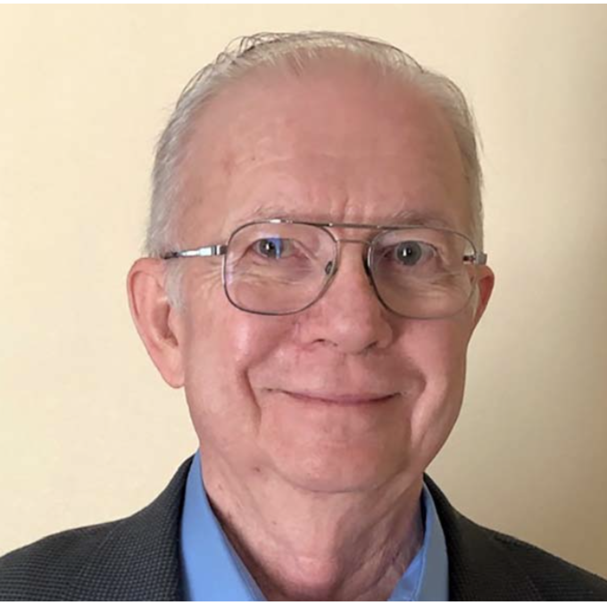

```{=html}
<!-- ── PAGE HEADER ────────────────────────────────────────────────────────────── -->
<section class="page-header">
  <div class="page-header-text">
    <div class="page-header-inner">
      <p class="page-header-label">Innovative Assessment Solutions</p>
      <h1>Meet Our Team</h1>
      <p class="page-header-sub">Dedicated experts in assessment, psychometrics, and data analytics</p>
    </div>
  </div>
  <div class="page-header-image" style="background-image:url('assets/images/pexels-fauxels-3184468-1.jpg');"></div>
</section>

<!-- ── INTRO ──────────────────────────────────────────────────────────────────── -->
<section class="section-white">
  <div class="section-container" style="text-align:center;">
    <h2 class="section-heading">Our Experts at Work</h2>
    <hr class="section-divider">
    <p style="max-width:780px; margin:0 auto; color:#555; font-size:1rem; line-height:1.85;">
      Innovative Assessment Solutions, LLC (IAS) is an early-stage startup company dedicated to
      making assessments more informative, actionable, and useful in educational settings. We
      achieve this by developing and employing novel psychometric methods alongside advanced and
      innovative data analytics. With extensive experience across all phases of assessment
      development and data analysis, our team's insights will revolutionize how student data is
      analyzed, displayed, and processed. We are committed to empowering teachers with tools
      they need to tailor instruction while collaborating with districts to enhance educational
      outcomes through data-driven strategies.
    </p>
  </div>
</section>

<!-- ── TEAM GRID ──────────────────────────────────────────────────────────────── -->
<section class="section-light">
  <div class="section-container">
    <div style="display:grid; grid-template-columns:repeat(4,1fr); gap:28px;">

      <!-- Jonathan Templin -->
      <div>
        <div class="team-card">
          <div class="team-photo-wrap">
            
          </div>
          <div class="team-card-body">
            <h3>Jonathan Templin, Ph.D.</h3>
            <p class="team-role">IAS Co-Founder</p>
            <p>
              Jonathan is Eugene T. Moore Endowed Professor in the Education and Human Development
              Department of the College of Education at Clemson University. His research interests
              are focused on the development of psychometric and general quantitative methods, as
              applied in the psychological, educational, and social sciences.
            </p>
          </div>
        </div>
      </div>

      <!-- Robert Brennan -->
      <div>
        <div class="team-card">
          <div class="team-photo-wrap">
            
          </div>
          <div class="team-card-body">
            <h3>Robert L. Brennan, Ed.D.</h3>
            <p class="team-role">IAS Co-Founder</p>
            <p>
              Dr. Brennan is the Founding Director of the Center for Advanced Studies in Measurement
              and Assessment at the University of Iowa's College of Education. He has authored
              numerous articles and books, served as president of NCME, and received the AERA
              Division D Linn Award (2020) and the E. F. Lindquist Award (2004).
            </p>
          </div>
        </div>
      </div>

      <!-- Anne Wilson -->
      <div>
        <div class="team-card">
          <div class="team-photo-wrap">
            
          </div>
          <div class="team-card-body">
            <h3>Anne Wilson, MBA</h3>
            <p class="team-role">IAS Co-Founder</p>
            <p>
              Anne's accounting career includes nearly 20 years at the University of Iowa, where
              she serves as Finance Manager for the Department of Ophthalmology &amp; Visual
              Sciences. She also assists businesses with accounting and tax needs, and loves
              enacting process improvements.
            </p>
          </div>
        </div>
      </div>

      <!-- Jacinta Olson -->
      <div>
        <div class="team-card">
          <div class="team-photo-wrap">
            
          </div>
          <div class="team-card-body">
            <h3>Jacinta Olson, Ph.D.</h3>
            <p class="team-role">Senior Psychometrician</p>
            <p>
              Jacinta has over five years of experience teaching mathematics in Iowa and Arizona.
              She blends educational measurement, cognitive psychology, and educational practices
              to create well-designed assessments that serve as powerful tools for tailoring
              instruction and optimizing student success.
            </p>
          </div>
        </div>
      </div>

    </div>
  </div>
</section>

<!-- ── CTA ────────────────────────────────────────────────────────────────────── -->
<section class="cta-banner">
  <div class="section-container">
    <h2>Work With Our Team</h2>
    <p>
      Ready to explore how IAS can support your district's assessment goals?
      We'd love to connect.
    </p>
    <a href="contact.qmd" class="btn-ias">Get in Touch</a>
  </div>
</section>
```
