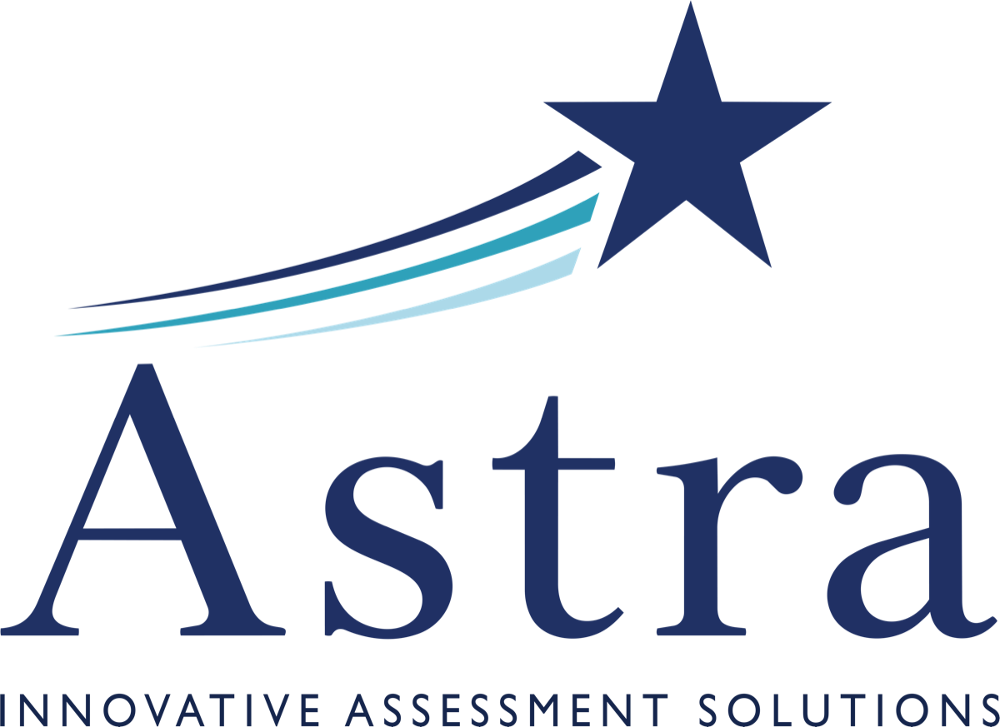

```{=html}
<section class="astra-page-hero">
  <div class="section-container">
    <div>
      <p class="astra-page-hero-eyebrow">The Astra Cycle</p>
      <div class="astra-page-hero-h1" role="heading" aria-level="1">Six moving parts, one continuous cycle.</div>
      <p class="lead">
        Here is what happens between the day a district selects standards and the day teachers open their reports.
      </p>
      <div style="display:flex; gap:14px; flex-wrap:wrap;">
        <a href="contact.qmd" class="btn-ias">Talk to Us About Your District</a>
      </div>
    </div>
    <div class="astra-page-hero-mark">
      
    </div>
  </div>
</section>

<section class="ias-badges">
  <div class="ias-badge">Kansas-Aligned Design<small>Built around Kansas standards and district scope and sequence</small></div>
  <div class="ias-badge">Real Districts, Real Gains<small>Humboldt USD saw an 11-point rise in students at KAP proficient or advanced in Year 1</small></div>
  <div class="ias-badge">Pending IADA Review<small>Application submitted to the U.S. Department of Education</small></div>
</section>

<section class="section-white">
  <div class="section-container" style="text-align:center;">
    <h2 class="section-heading">From scope and sequence to standard-level mastery in six steps.</h2>
    <hr class="section-divider">
    <div style="display:grid; grid-template-columns:repeat(3,1fr); gap:28px; text-align:left;">
      <div class="step-card">
        <span class="step-num">STEP 01</span>
        <h3>Districts select standards</h3>
        <p>At the start of each quarter, a district's assessment lead selects the specific state standards students are being taught. Astra does not assume what you are teaching &mdash; it asks.</p>
      </div>
      <div class="step-card">
        <span class="step-num">STEP 02</span>
        <h3>Aligned items</h3>
        <p>Astra assembles a quarterly assessment of roughly 20 items, calibrated to the standards you selected and varying in complexity so students at different ability levels are measured with equal precision.</p>
      </div>
      <div class="step-card">
        <span class="step-num">STEP 03</span>
        <h3>Quarterly assessments</h3>
        <p>Delivered within a common assessment window, the assessment is short by design &mdash; Astra is meant to inform instruction, not consume it.</p>
      </div>
      <div class="step-card">
        <span class="step-num">STEP 04</span>
        <h3>Bayesian calibration</h3>
        <p>Responses are scored using a two-stage Bayesian Structural Equation Modeling architecture: item calibration in stage one, higher-order aggregation in stage two.</p>
      </div>
      <div class="step-card">
        <span class="step-num">STEP 05</span>
        <h3>Detailed reports, fast</h3>
        <p>Teachers receive standard-by-standard score reports along with the items and student responses within days of the assessment window closing.</p>
      </div>
      <div class="step-card">
        <span class="step-num">STEP 06</span>
        <h3>KAP prediction accrues</h3>
        <p>As quarterly data accumulates across the year, Astra produces a composite score that predicts end-of-year KAP performance with published R&#178; values of 0.70&ndash;0.90 in pilot data.</p>
      </div>
    </div>
  </div>
</section>

<!-- ── THE ASSESSMENTS ────────────────────────────────────────────────────────── -->
<section class="section-navy">
  <div class="section-container">
    <p class="astra-spotlight-eyebrow" style="text-align:center;">The Assessments</p>
    <h2 class="section-heading" style="text-align:center;">Four quarters. Two subjects. Standards you choose.</h2>
    <div style="width:60px; height:4px; background:#67ABE9; margin:0 auto 40px;"></div>
    <p style="max-width:820px; margin:0 auto 48px; color:rgba(255,255,255,0.85); font-size:1rem; line-height:1.85; text-align:center;">
      Astra delivers four quarterly benchmark assessments across two subjects. For each quarter, districts select the specific standards being taught and, in ELA, the topical area for the quarter's reading passage. Every assessment is built around district input &mdash; nothing is prescribed by a national item bank.
    </p>
    <div style="display:grid; grid-template-columns:repeat(2,1fr); gap:28px;">
      <div class="philosophy-card">
        <h3>Mathematics</h3>
        <p style="color:#00102E; font-weight:700; font-size:1.1rem; margin:0 0 14px; line-height:1.4;">Grades 2&ndash;8, plus Algebra I, Algebra II, and Geometry.</p>
        <p style="color:#444; font-size:0.95rem; line-height:1.7; margin:0;">Districts pick up to four standards for the quarter. Astra assembles a 20-item assessment &mdash; five items per standard &mdash; calibrated to those exact standards and varying in complexity so students at different ability levels are measured with equal precision.</p>
      </div>
      <div class="philosophy-card">
        <h3>English Language Arts</h3>
        <p style="color:#00102E; font-weight:700; font-size:1.1rem; margin:0 0 14px; line-height:1.4;">Grades 2 through high school.</p>
        <p style="color:#444; font-size:0.95rem; line-height:1.7; margin:0;">Districts pick up to four standards plus the topical area for the quarter's reading passage. Astra assembles 20 items &mdash; five per standard &mdash; all grounded in one shared, curriculum-relevant reading passage that anchors the entire assessment.</p>
      </div>
    </div>
    <div style="max-width:820px; margin:48px auto 0; padding:24px 30px; background:rgba(255,255,255,0.08); border-left:4px solid #67ABE9; border-radius:4px; color:rgba(255,255,255,0.90); font-size:0.95rem; line-height:1.75;">
      <strong style="color:white;">How results are reported.</strong>
      Every report shows results at the standard level &mdash; teachers see how each student, and the class, performed on every standard assessed. Alongside the standard-level report, each student receives an overall <em>longitudinal prediction</em> of their end-of-year KAP score. As more quarterly data accumulates across the year, that prediction becomes more precise.
    </div>
  </div>
</section>

<section class="section-light">
  <div class="section-container">
    <div class="split-panel">
      <div class="split-panel-text">
        <p class="astra-spotlight-eyebrow" style="color:#233452;">What Teachers See</p>
        <h2 class="section-heading">Standard-level results, not a single composite score.</h2>
        <hr class="section-divider-left">
        <p style="color:#555; font-size:1rem; line-height:1.85; margin-bottom:20px;">
          Composite scores at the subject level tell a teacher that a class is above or below proficient. They do not tell that teacher which fractions standard the class missed, which standard is the class is strong on, or which standard needs reteaching next week. Astra reports resolve those questions at the level teachers actually plan instruction around.
        </p>
        <p style="color:#555; font-size:1rem; line-height:1.85; margin:0;">
          Each report shows every standard assessed that quarter, the items and item responses of each student, and an overall prediction of how students will perform on the KAP assessment at the end of the year. Teachers are not asked to interpret psychometric jargon &mdash; the report speaks in the same units teachers use to teach.
        </p>
      </div>
      <div class="split-panel-image">
        
      </div>
    </div>
  </div>
</section>

<section class="section-navy">
  <div class="section-container">
    <div class="split-panel">
      <div class="split-panel-image">
        
      </div>
      <div class="split-panel-text">
        <p class="astra-spotlight-eyebrow">What Administrators See</p>
        <h2 class="section-heading">KAP prediction that stays honest across the year.</h2>
        <hr class="section-divider-left">
        <p style="color:rgba(255,255,255,0.85); font-size:1rem; line-height:1.85; margin-bottom:20px;">
          For principals and superintendents, Astra rolls up quarterly data into a KAP-predictive composite that updates each quarter as new evidence arrives. Because the composite is grounded in items aligned to the standards Kansas actually assesses on KAP, the prediction is stronger than what generic national benchmark products can produce.
        </p>
        <div class="ias-callout" style="background:rgba(255,255,255,0.10); border-left-color:#67ABE9; color:rgba(255,255,255,0.90);">
          <strong style="color:white;">Item release, quarter by quarter.</strong>
          Unlike national benchmark products that keep items secret, Astra releases previously administered items each quarter for instructional use. Teachers can use released items in classroom review, formative check-ins, and parent conferences &mdash; turning the assessment into an instructional resource, not just a measurement.
        </div>
      </div>
    </div>
  </div>
</section>

<section class="section-white">
  <div class="section-container">
    <p class="astra-spotlight-eyebrow" style="color:#233452;">Independent Review</p>
    <h2 class="section-heading">Under federal review.</h2>
    <hr class="section-divider-left">
    <p style="max-width:820px; color:#555; font-size:1rem; line-height:1.85;">
      Astra's application to the U.S. Department of Education's Innovative Assessment Demonstration Authority (IADA) program is currently pending federal review. IADA is the only federal pathway for a state to use an innovative assessment system in place of its existing summative assessment for accountability purposes. Approval requires the same technical rigor that applies to any state accountability test.
    </p>
  </div>
</section>

<section class="cta-banner">
  <div class="section-container">
    <h2>See it applied to your district.</h2>
    <p>Scheduling a 20-minute walkthrough is the fastest way to know whether Astra fits your needs.</p>
    <div style="display:flex; gap:16px; justify-content:center; flex-wrap:wrap;">
      <a href="contact.qmd" class="btn-ias">Schedule Your Walkthrough</a>
    </div>
  </div>
</section>
```
