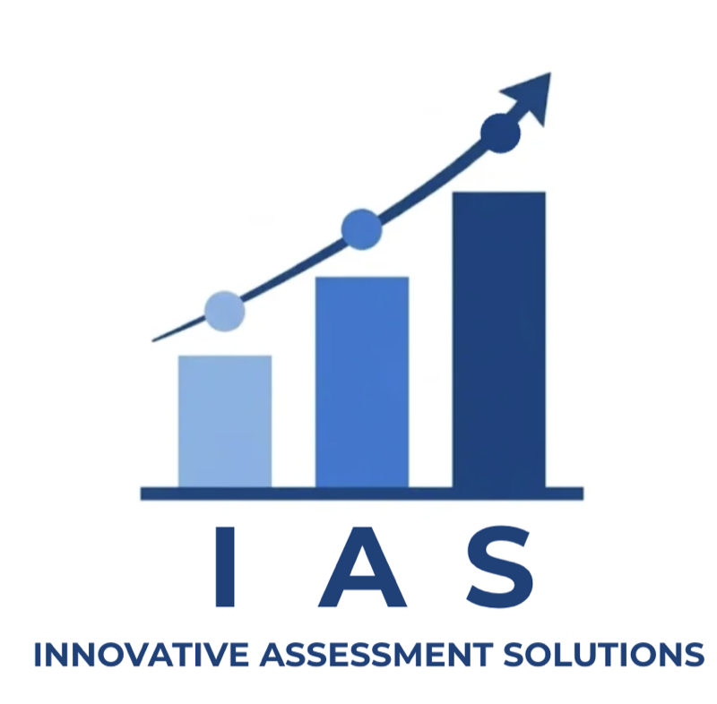

```{=html}
<!-- ── HERO ─────────────────────────────────────────────────────────────────── -->
<section class="ias-hero" style="
  background-image: url('assets/images/pexels-fauxels-3184468-1.jpg');
  background-size: cover;
  background-position: center;
  position: relative;">
  <div style="position:absolute; inset:0; background:linear-gradient(135deg, rgba(0,16,46,0.85) 0%, rgba(35,52,82,0.80) 100%);"></div>
  <div class="section-container" style="position:relative; z-index:1;">
    <div class="ias-hero-h1" role="heading" aria-level="1">Actionable Assessment Data</div>
    <p class="hero-subtitle">Meet Astra: Curriculum-aligned, standard-specific,<br>delivered in time to change instruction</p>
    <div style="display:flex; gap:16px; justify-content:center; flex-wrap:wrap;">
      <a href="astra-assessments.qmd" class="btn-ias">Explore Astra</a>
      <a href="contact.qmd" class="btn-ias-outline">Get in Touch</a>
    </div>
  </div>
</section>

<!-- ── VISION & MISSION ───────────────────────────────────────────────────────── -->
<section class="section-light" style="padding-top:clamp(60px,6vw,80px); padding-bottom:clamp(60px,6vw,80px);">
  <div class="section-container" style="text-align:center;">
    
    <h2 class="section-heading">Our Vision and Mission</h2>
    <hr class="section-divider">
    <p style="max-width:740px; margin:0 auto; color:#555; font-size:1rem; line-height:1.85;">
      Our mission is to build assessments that turn student data into instructional action.
      Whether through Astra&mdash;our flagship through-year system in Kansas&mdash;or through
      direct partnerships with assessment vendors, districts, and states, IAS delivers assessment
      data educators can actually use to guide instruction, accelerate learning, and improve
      results.
    </p>
    <div style="margin-top:36px;">
      <a href="about.qmd" class="btn-ias">Meet Our Team</a>
    </div>
  </div>
</section>

<!-- ── ASTRA SPOTLIGHT—PIVOT TO KANSAS ────────────────────────────────────── -->
<section class="astra-spotlight">
  <div class="section-container">
    <div class="astra-spotlight-grid">
      <div>
        <p class="astra-spotlight-eyebrow">Our Kansas Work</p>
        <h2>Astra: a through-year assessment system built in Kansas, specifically for Kansas</h2>
        <p class="lead">
          Astra is IAS's flagship assessment product—a quarterly benchmark platform aligned to
          each district's scope and sequence, developed in partnership with the Kansas districts.
          We release every assessment item and deliver standard-by-standard reports on each
          student's item responses within days of each administration. Our quarterly composite
          scores explain
          70–90% of the variance in end-of-year KAP scores.
        </p>
        <div style="display:flex; gap:14px; flex-wrap:wrap;">
          <a href="astra-assessments.qmd" class="btn-ias">Astra Assessments</a>
          <a href="cohort.qmd" class="btn-ias-outline">2026–27 Kansas Cohort</a>
        </div>
      </div>
      <div class="astra-spotlight-mark">
        
        <div class="mark-caption">Ad Astra Per Aspera</div>
      </div>
    </div>
  </div>
</section>

<!-- ── IN THE NEWS ────────────────────────────────────────────────────────────── -->
<section class="section-light">
  <div class="section-container">
    <p class="astra-spotlight-eyebrow" style="color:#233452; text-align:center;">In the News</p>
    <h2 class="section-heading" style="text-align:center;">Recent coverage of Astra and the Kansas pilot.</h2>
    <hr class="section-divider">
    <div class="news-grid">
      <article class="news-card">
        <p class="news-meta"><span class="news-source">JC Post</span><span class="news-date">August 2, 2026</span></p>
        <h3><a href="https://jcpost.com/posts/d9448047-80a5-4c6d-aeef-43f0af922ec2" target="_blank" rel="noopener">USD 475 part of new pilot approach to statewide assessment and accountability</a></h3>
        <p>Geary County USD 475 joins five other Kansas districts implementing quarterly through-year assessments in place of a single end-of-year test for the 2026&ndash;27 school year.</p>
      </article>
      <article class="news-card">
        <p class="news-meta"><span class="news-source">Kansas State Department of Education</span><span class="news-date">July 31, 2026</span></p>
        <h3><a href="https://www.ksde.gov/news-center/news-releases/2026/07/31/kansas-receives-federal-approval-to-pilot-innovative-through-year-assessment-system" target="_blank" rel="noopener">Kansas receives federal approval to pilot innovative through-year assessment system</a></h3>
        <p>KSDE announces U.S. Department of Education approval to pilot a through-year assessment system under the Innovative Assessment Demonstration Authority (IADA)&mdash;the assessment KSDE is deploying is Astra.</p>
      </article>
      <article class="news-card">
        <p class="news-meta"><span class="news-source">WIBW-TV</span><span class="news-date">July 31, 2026</span></p>
        <h3><a href="https://www.wibw.com/2026/07/31/six-kansas-districts-pilot-new-quarterly-testing-program/" target="_blank" rel="noopener">Six Kansas districts to pilot new quarterly testing program</a></h3>
        <p>Coverage of the six-district cohort and how quarterly assessments will replace or run alongside KAP starting in the 2026&ndash;27 school year.</p>
      </article>
      <article class="news-card">
        <p class="news-meta"><span class="news-source">KSNT-TV</span><span class="news-date">July 31, 2026</span></p>
        <h3><a href="https://www.ksnt.com/news/local-news/six-kansas-school-districts-to-adopt-new-assessment-system/" target="_blank" rel="noopener">Six Kansas school districts to adopt new assessment system</a></h3>
        <p>Local reporting on the launch of Kansas's federally approved through-year assessment pilot.</p>
      </article>
    </div>
  </div>
</section>

<!-- ── CTA ────────────────────────────────────────────────────────────────────── -->
<section class="cta-banner">
  <div class="section-container">
    <h2>Ready to Revolutionize Your Assessments?</h2>
    <p>
      Whether you are a Kansas district exploring the 2026–27 Astra cohort or a district outside of
      Kansas wanting to bring the power of our assessments to your state, we would like to hear from you.
    </p>
    <div style="display:flex; gap:16px; justify-content:center; flex-wrap:wrap;">
      <a href="contact.qmd" class="btn-ias">Start the Conversation</a>
    </div>
  </div>
</section>

```
