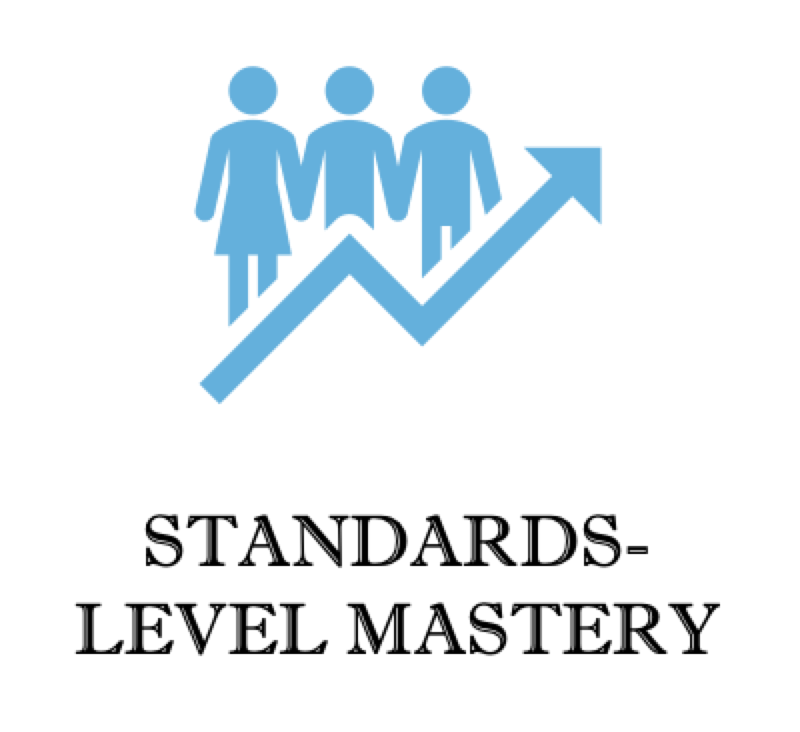
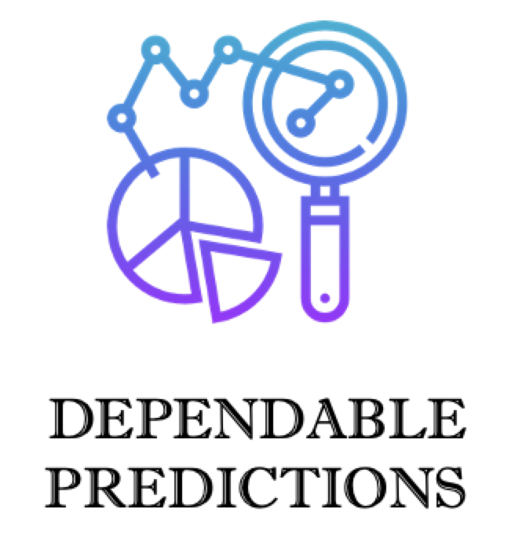

```{=html}
<!-- ── PAGE HEADER ────────────────────────────────────────────────────────────── -->
<section class="page-header">
  <div class="page-header-text">
    <div class="page-header-inner">
      <p class="page-header-label">Innovative Assessment Solutions</p>
      <h1>Resources</h1>
      <p class="page-header-sub">Empowering educators with innovative assessment tools</p>
    </div>
  </div>
  <div class="page-header-image" style="background-image:url('assets/images/spark.png'); background-size:contain; background-repeat:no-repeat; background-position:center; background-color:#1a3a6b;"></div>
</section>

<!-- ── QUOTE ──────────────────────────────────────────────────────────────────── -->
<div class="quote-banner">
  <div class="section-container">
    <blockquote>
      "Effective assessments ignite the spark of true learning."
    </blockquote>
  </div>
</div>

<!-- ── INTRO ──────────────────────────────────────────────────────────────────── -->
<section class="section-white">
  <div class="section-container" style="text-align:center;">
    <h2 class="section-heading">Tailored for Today's Classrooms</h2>
    <hr class="section-divider">
    <p style="max-width:780px; margin:0 auto; color:#555; font-size:1rem; line-height:1.85;">
      Current assessment systems lack flexibility and fail to adapt to students' individual
      progress. They are also not aligned with what is being taught at the moment, making it
      difficult for educators to provide timely and relevant support. At Innovative Assessment
      Solutions, we provide precise, actionable insights to help educators tailor instruction
      and support better educational outcomes.
    </p>
  </div>
</section>

<!-- ── PROFICIENCY SCREENERS ─────────────────────────────────────────────────── -->
<section class="section-light">
  <div class="section-container">
    <div style="text-align:center; margin-bottom:56px;">
      <h2 class="section-heading">IAS Proficiency Screeners</h2>
      <hr class="section-divider">
      <p style="max-width:740px; margin:0 auto; color:#555; font-size:1rem; line-height:1.85;">
        <strong>Tailored Assessments for Targeted Success.</strong> Imagine if districts could
        choose not just what to teach, but also what to test. At IAS, we make this a reality.
        We collaborate with districts to create customized assessments that align with their
        unique curriculum, providing precise, actionable insights that support better
        educational outcomes.
      </p>
    </div>

    <div style="display:grid; grid-template-columns:repeat(4,1fr); gap:28px;">
      <div class="feature-card">
        
        <p>
          We work with districts to create screeners tailored to their current curriculum,
          ensuring clear and impactful insights that immediately inform instruction.
        </p>
      </div>
      <div class="feature-card">
        
        <p>
          Our screeners provide clear, comprehensive reports on each standard, with separate
          reports designed specifically for districts and classroom teachers.
        </p>
      </div>
      <div class="feature-card">
        
        <p>
          We provide detailed insights into student mastery of specific standards, enabling
          targeted instruction and truly personalized learning pathways.
        </p>
      </div>
      <div class="feature-card">
        
        <p>
          Our screeners accurately predict student performance on state assessments and can
          forecast improvements in overall math ability based on growth in specific standards.
        </p>
      </div>
    </div>
  </div>
</section>

<!-- ── WHITE PAPER ────────────────────────────────────────────────────────────── -->
<section class="section-white">
  <div class="section-container">
    <div class="split-panel">
      <div class="split-panel-image">
        
      </div>
      <div class="split-panel-text">
        <h2 class="section-heading">Read Our White Paper</h2>
        <hr class="section-divider-left">
        <p style="color:#555; font-size:1rem; line-height:1.85; margin-bottom:32px;">
          Discover cutting-edge insights and strategies in our comprehensive white paper.
          This document highlights key outcomes and provides an in-depth overview of emerging
          trends, innovative technologies, and a detailed plan of action for transforming
          educational assessment in your district.
        </p>
        <a href="assets/pdf/White-Paper-v1.0.pdf" class="btn-ias" target="_blank">
          Download White Paper
        </a>
      </div>
    </div>
  </div>
</section>

<!-- ── ADDITIONAL SERVICES ────────────────────────────────────────────────────── -->
<section class="section-navy">
  <div class="section-container" style="text-align:center;">
    <h2 class="section-heading">Expand Your Capabilities</h2>
    <hr class="section-divider">
    <p style="color:rgba(255,255,255,0.78); font-size:1rem; max-width:760px; margin:0 auto 56px; line-height:1.85;">
      IAS also offers comprehensive services in psychometric consulting, data analytics, and
      content development. We ensure reliable and valid assessments through advanced statistical
      analysis, provide actionable insights to improve student performance, and develop
      high-quality content to support diverse testing needs.
    </p>

    <div style="display:grid; grid-template-columns:repeat(3,1fr); gap:24px; max-width:920px; margin:0 auto 56px;">
      <div class="service-mini-card">
        <h3>Psychometric Consulting</h3>
        <p>
          Advanced statistical expertise to ensure your assessments are reliable, valid, and
          fully defensible against scrutiny.
        </p>
      </div>
      <div class="service-mini-card">
        <h3>Data Analytics</h3>
        <p>
          Actionable insights derived from assessment data that drive targeted, measurable
          improvements in student performance.
        </p>
      </div>
      <div class="service-mini-card">
        <h3>Content Development</h3>
        <p>
          High-quality assessment content developed by experts to support diverse testing needs
          and learning standards across grade levels.
        </p>
      </div>
    </div>

    <a href="contact.qmd" class="btn-ias">Start the Conversation</a>
  </div>
</section>
```
